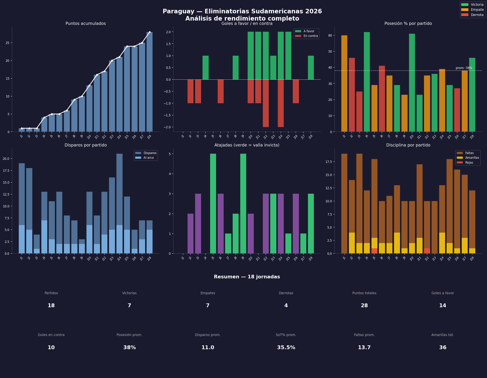

# Paraguay — Eliminatorias Sudamericanas 2026

Análisis de rendimiento completo de la Selección Paraguaya
durante las 18 jornadas de las Eliminatorias CONMEBOL 2026,
usando datos de FBref.

## Dashboard completo

## Conclusiones principales
- **28 puntos** en 18 partidos — clasificación conseguida
- **7V / 7E / 4D** — equipo consistente, pocas derrotas
- Posesión promedio del **38%** — estilo de bloque bajo y contraataque
- **35.5% de precisión** en disparos — área a mejorar de cara al Mundial
- **36 amarillas** en el torneo — disciplina a trabajar

## Fuente de datos
- [FBref — Paraguay WCQ 2026](https://fbref.com/en/squads/d2043442/2026/matchlogs/c4/schedule/Paraguay-Men-Scores-and-Fixtures-WCQ----CONMEBOL-M)

## Herramientas
- Python 3.14
- pandas / matplotlib
- openpyxl

## Autor
Gonzalo — [@GonnAnalytics](https://github.com/GonnAnalytics)